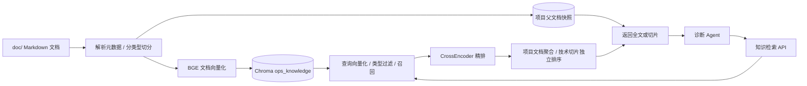

# rag-service

运维 Agent 项目的知识检索服务。将项目架构、排查手册与中间件技术文档切分并存入 Chroma，通过向量召回和 CrossEncoder 精排，向诊断 Agent 返回相关资料。

服务使用 Python + FastAPI，负责知识入库和检索，不调用生成模型回答问题，也不保存聊天记录。诊断回答和会话持久化由 `ops-diagnosis-agent` 完成。

## 在整个项目中的位置

[ops-agent](https://github.com/wang-kang-tuoinai/ops-agent) 结合现场观测证据与知识库完成故障分析：

| 模块 | 职责 |
| --- | --- |
| `ops-agent-backend` | 示例业务及故障演练对象，产生日志和 Trace |
| `obs-api` | 查询日志和链路，提供统计、下钻及可视化快照 |
| `ops-diagnosis-agent` | 调用观测与知识工具，结合证据生成诊断回答 |
| **`rag-service`** | 管理运维知识索引，返回完整项目文档或技术切片 |
| `rag-gateway` | 聊天、知识引用展示和日志/Trace 联动面板 |



Agent 将检索资料与实际日志、Trace 核对。文档用于解释项目设计和排查方法，不能单独证明某次故障已经发生。

## 知识组织与切分

| 文档类型 | 内容 | 入库与返回方式 |
| --- | --- | --- |
| `architecture` | 项目依赖、调用路径、业务行为与边界 | 按二级标题切分检索章节，命中后返回对应完整文档 |
| `runbook` | 按症状组织的验证步骤和处置建议 | 同样按章节检索，返回完整排查流程 |
| `technology` | Redis、MySQL、RabbitMQ 等技术资料 | 对长章节继续细分，直接返回命中的切片，不加载整篇原文 |

向量化文本统一拼接 **文档标题 + 章节标题/路径 + 章节正文**，让单独章节保留语义背景。YAML 元数据单独写入 Chroma metadata，不混入向量化正文。

项目文档章节保留其下的子标题、表格和代码；超过模型 token 上限时明确报错，需调整原文。技术文档先按二级标题切分，超长时沿子标题、段落、列表项和句子继续拆分；同章节内的连续片段保留最多约 12% 正文 token 预算的重叠，不跨章节重叠。

切分会识别代码围栏，长表格按行拆分并重复表头。单个不可拆代码块或表格行超限时报错，不静默丢弃内容。入库前用 tokenizer 和真实 embedding 模型的长度配置校验。

### 文档元数据

所有知识文档使用 Markdown + YAML front matter。项目文档示例：

```markdown
---
id: runbook-cache-timeout
doc_type: runbook
project: ops-agent
service: ops-agent-backend
component: redis
deployment: docker-compose
---
# 缓存超时排查

## 适用范围与症状
正文……

## 验证步骤
正文……
```

技术文档最少提供 `doc_type`、`component`、`source_url`；可选显式 `id`。示例中的 URL 应替换为真实来源：

```yaml
doc_type: technology
component: mysql
source_url: https://example.com/mysql-guide
id: technology-mysql-locks
```

没有显式 id 时，技术文档使用规范化来源 URL 的 SHA-256 生成身份。同一个来源大文档拆成多个文件时，各文件必须填写不同且稳定的 id，避免因 URL 相同导致冲突。文件头的 id 入库后转换为 doc_id，不重复存两个字段。

详细规则见 [入库说明](maintenance/ingestion.md)。`maintenance/` 是给开发者看的维护资料，不属于知识库来源；入库仅遍历 `doc/` 中的 Markdown，并跳过 README.md。

## 检索流程

1. 校验 query、可选 doc_type 和 top_k；为查询添加 BGE 检索前缀并向量化。
2. 从 `ops_knowledge` 召回最多 20 个章节/切片，doc_type 直接作为 Chroma 元数据过滤条件。
3. 使用 `BAAI/bge-reranker-base` 对原始 query 与候选文本逐对精排。
4. architecture/runbook 按 doc_id 聚合，每篇文档的最高章节分数作为文档分数；technology 每个切片独立计分。
5. 将全文候选和切片候选统一排序，取 top_k；项目文档从入库快照读取全文，技术资料直接返回切片。

项目结果的 `matched_sections` 来自被召回章节的 metadata.section。技术切片不按文章合并，同一篇文章可以有多个切片入选。父文档快照按 SHA-256 校验，避免查询时混用当前源文件与旧索引。

所有结果正文合计默认最多 16000 个 Python 字符。超预算的结果整条省略并写入 notices，不截断后冒充完整文档，也不从后续排名补位，因此最终条数可以小于 top_k。

精排分数不是概率或置信度，当前没有相关性拒答阈值；返回的是候选资料。知识引用 ID 和面向模型的字段精简由 Agent 的 `rag_tools.py` 完成，本服务保留来源与索引元数据供其处理。

## 启动与入库

### 本地运行

推荐 Python 3.13，与 Docker 镜像一致。在 **rag-service 根目录**执行：

```powershell
python -m venv .venv
.\.venv\Scripts\python.exe -m pip install -r requirements.txt
.\.venv\Scripts\python.exe ingest.py --dry-run
.\.venv\Scripts\python.exe ingest.py
$env:OTEL_EXPORTER_OTLP_ENDPOINT = "http://127.0.0.1:4318"
.\.venv\Scripts\python.exe -m uvicorn main:app --host 127.0.0.1 --port 8000
```

首次运行可能下载 Hugging Face 模型和 tokenizer，需准备网络或完整缓存。`--dry-run` 只校验元数据和切分，不加载模型权重、不写索引，但缓存不足时仍可能下载 tokenizer 与配置。已有完整、最新的索引时可直接启动服务。

服务在 lifespan 中加载 embedding、reranker 和 collection，查询复用这些依赖。缺少 `ops_knowledge` 时启动失败并提示先入库，不会自动创建空索引。Windows 下的 `start_server.bat` 可在虚拟环境和索引就绪后启动 HTTP 服务。

### Docker Compose

在 **ops-agent 根目录**操作。先检查 `docker-compose.yml` 的 Hugging Face 缓存挂载：当前使用 `C:/Users/HP/.cache/huggingface`，换机器需改成自己的路径。

首次构建及入库：

```sh
docker compose build rag-service
docker compose run --rm --no-deps rag-service python ingest.py --dry-run
docker compose run --rm --no-deps rag-service python ingest.py
docker compose up -d rag-service
```

入库命令复用 Compose 中的模型缓存和 `my_chroma_data` 挂载。服务自身不需要模型 API 密钥，不调用 DeepSeek；完整诊断项目中的生成模型由 Agent 配置。

| 位置 | 内容 |
| --- | --- |
| `/app/hf_home` | 模型缓存，Dockerfile 设置 HF_HOME 指向这里 |
| `/app/my_chroma_data` | 挂载本仓库的 Chroma 数据及父文档快照 |
| `http://rag-service:8000/api/v1` | Compose 网络内供 Agent 访问的地址 |

根 Compose 默认不映射 rag-service 的宿主机端口。本地直接调试 HTTP 可用上面的 uvicorn 命令；容器就绪检查可执行：

```sh
docker compose exec rag-service python -c "import urllib.request; print(urllib.request.urlopen('http://localhost:8000/health').read().decode())"
```

源文档随镜像复制。修改 `doc/` 后使用容器入库，应先重新构建镜像，避免读取旧版文档。

### 索引更新与持久化

- `ingest.py` 默认从脚本所在目录的 `doc/` 读取，写入 `my_chroma_data/`；可通过 `--root`、`--db-path` 覆盖入库路径。HTTP 服务仍使用仓库内固定数据路径，修改入库目标不会自动改变服务读取位置。
- 入库是 **全量同步**：先生成切片与向量，保存项目父文档快照，再 upsert，最后删除不在本次输入中的旧切片。`--root` 表示整个集合的期望内容，不是增量追加目录。
- 不应同时运行多个入库进程，更新时暂停查询。流程不是原子切换，中途失败后需重新运行完成同步。
- 更新现有容器环境时，可先 `docker compose stop rag-service`，完成重建、入库后再启动。删除并重新创建 collection 后必须重启服务，重新获取 collection。
- 父文档位于 `my_chroma_data/ops_knowledge_parents/`，应与 Chroma 数据一起保留；旧快照暂不自动清理。只有技术文档的索引不需要父文档快照。

## 模型与配置

| 项目 | 当前配置 |
| --- | --- |
| Embedding | `BAAI/bge-base-zh-v1.5`，归一化向量，Chroma cosine 距离 |
| Reranker | `BAAI/bge-reranker-base` |
| Collection | `ops_knowledge` |
| `HF_HOME` | Hugging Face 缓存目录；Docker 内为 `/app/hf_home` |
| `HF_HUB_OFFLINE` | 缓存完整时可设为 `1`，离线加载模型/配置 |
| `OTEL_EXPORTER_OTLP_ENDPOINT` | Trace 上报地址，Compose 为 `http://jaeger:4318` |

模型名目前在 `ingest.py` 和 `main.py` 中配置，不能仅设置环境变量切换。更换 embedding 时需同步修改入库与查询模型，并重新构建兼容的索引，不能混用旧向量。FastAPI 已接入 OpenTelemetry，服务名为 `rag-service`。

## HTTP API

| 方法 | 路径 | 用途 |
| --- | --- | --- |
| GET | `/health` | 应用与模型、collection 的加载状态 |
| POST | `/api/v1/knowledge/search` | 检索运维知识 |
| GET | `/docs` | FastAPI 请求与响应模型说明 |

请求示例：

```json
{
  "query": "Redis 读取超时后，用户查询如何回源和排查？",
  "doc_type": "runbook",
  "top_k": 3
}
```

query 必填，去空白后非空且输入最多 2000 字符；doc_type 可省略，或为 architecture/runbook/technology；top_k 默认为 3，范围 1–5。暂不提供 service/component 过滤参数，传入未声明字段会返回 422。

响应顶层为 `items` 和 `notices`，结果通过 content_mode 区分：

| 结果 | 主要字段 |
| --- | --- |
| 公共字段 | doc_id、title、source、score、content、doc_type |
| `content_mode=full` | architecture/runbook 全文，另含 snapshot_id、matched_sections |
| `content_mode=chunk` | technology 切片，另含 chunk_id、component、source_url、section、chunk_index |

无候选可以返回 200 和空 items，应查看 notices；参数错误返回 422，模型/索引/快照不可用或检索失败返回 503。健康检查成功不保证每篇父文档快照都有效，也不是检索质量评估。

本地服务请求示例：

```powershell
$body = @{ query = "Redis 读取超时后如何排查"; top_k = 3 } | ConvertTo-Json
Invoke-RestMethod -Method Post -Uri "http://127.0.0.1:8000/api/v1/knowledge/search" -ContentType "application/json; charset=utf-8" -Body ([System.Text.Encoding]::UTF8.GetBytes($body))
```

完整契约见 [知识查询接口](maintenance/knowledge-search-api.md)。

## 目录与切片查看器

```text
main.py                   服务生命周期、模型加载、健康检查与埋点
knowledge_api.py          HTTP 检索入口与错误映射
knowledge_models.py       请求和全文/切片响应模型
knowledge.py              召回、精排、聚合排序与父文档读取
ingest.py                 文档校验、分类型切片和全量同步
markdown_splitter.py      Markdown 结构切分与 token 预算
doc/
  architecture/           项目架构知识
  runbooks/               排查手册
  technology/             Redis、MySQL、RabbitMQ 技术资料
ingestion/                语料爬取与预处理辅助脚本
maintenance/              面向开发者的维护文档，不参与入库
tests/                    入库、检索及生命周期测试
my_chroma_data/            生成的索引及父文档快照，Git 忽略
view_chunks.py            Streamlit 切片查看页面
```

`ingestion/` 中的辅助脚本用于准备原始资料，运行前需检查各脚本的输入、输出路径和额外依赖；不会由服务自动执行。整理完成的 Markdown 放入 `doc/` 后再入库。

切片查看器需要单独安装 Streamlit（不属于当前服务 requirements）：

```powershell
.\.venv\Scripts\python.exe -m pip install streamlit
.\.venv\Scripts\python.exe -m streamlit run view_chunks.py --server.port 8501
```

浏览器访问 `http://localhost:8501` 查看切片正文和元数据，也可使用 `run_viewer.bat`。查看器会一次读取集合中的切片，定位为本地小规模检查工具。

## 测试与边界

在本仓库根目录运行：

```powershell
.\.venv\Scripts\python.exe -m unittest discover -s tests -t . -v
```

测试使用模拟模型、合成文档与临时/内存 Chroma 集合，不重建正式索引、不请求生成模型。测试分组见 [tests/README.md](tests/README.md)。

当前尚未实现鉴权、多租户索引、在线原子切换、相邻技术切片合并或基于相关性阈值的拒答。reranker 的 query + 文本组合仍可能受其输入长度限制。源码测试不能替代真实问句的召回质量评测，需要用故障场景持续核对检索结果。

开发者维护资料入口见 [maintenance/README.md](maintenance/README.md)。
